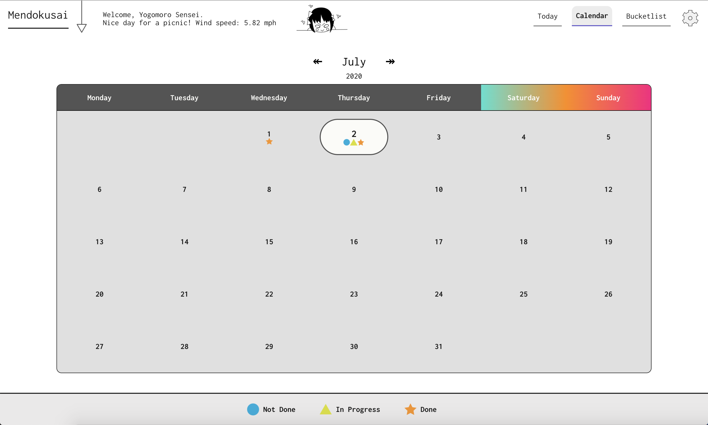
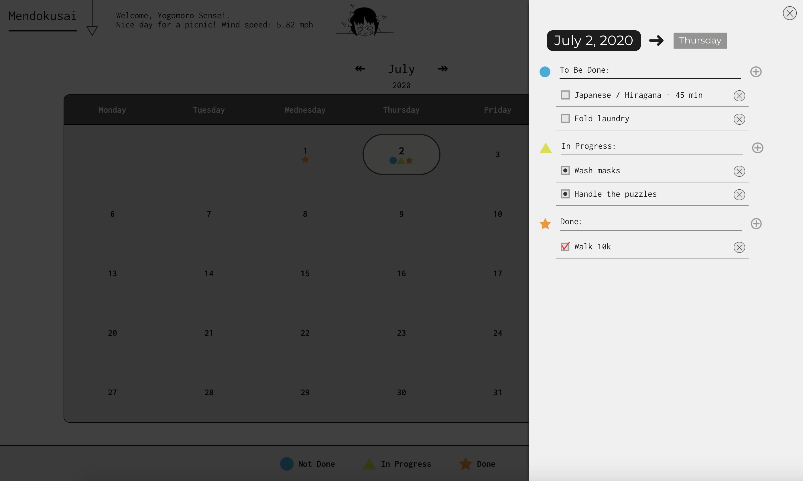
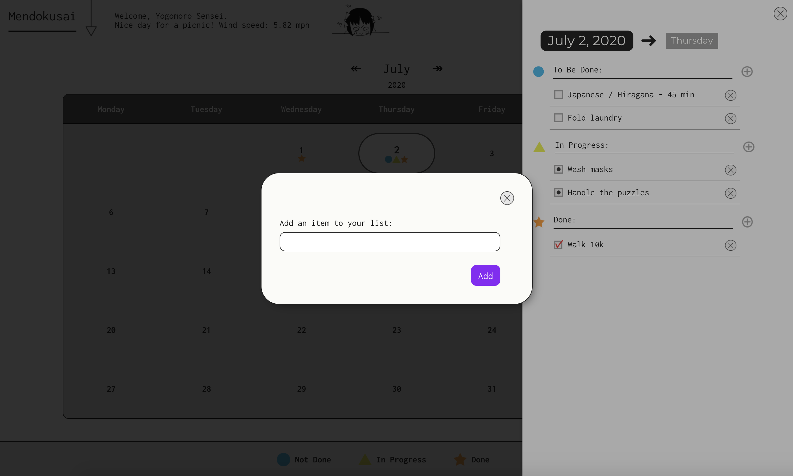
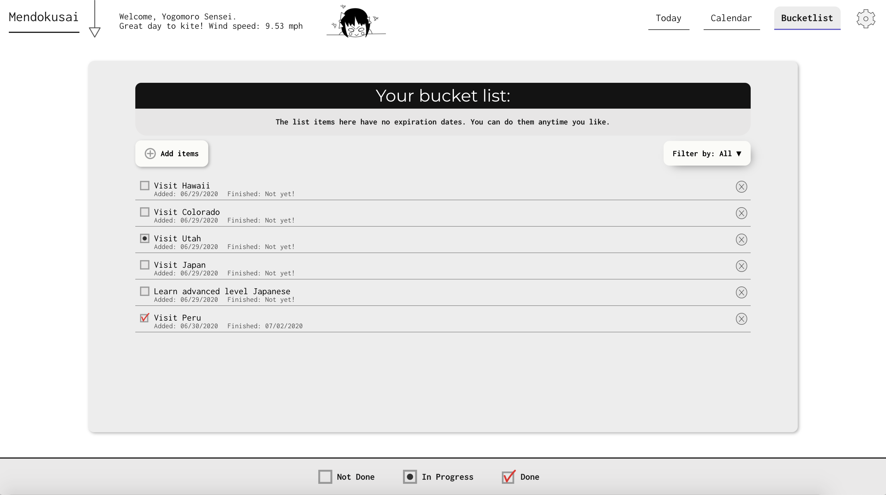

# Mendokusai

:japanese_castle: A todo list app for people who have problem planning their days. By dividing things you need to do in bite size pieces, you can have a more productive day and feel more motivated and satisfied at the end of the day.

**Demo:** Try it yourself [by clicking here!](https://mendokusai.app)

## How to use:

1. [Sign Up!](https://mendokusai.app/signup) You will need to verify your email address before you can login. Watch out for the incoming email!

2. After you login, the page which lays down that day's tasks will open. It also shows the current weather and temperature in your area, and determines if you can fly a kite that day.

   

3. You can add new todo's by clicking the add button. You can change the todo's status to 'in progress / done / not done' by clicking on the todo itself or the checkbox.

   

4. You can use the calendar to see the upcoming days and plan for them as well.

   

5. You can see that day's plans by clicking on them.

   

6. You can add todo's from calendar page as well.

   

7. You can also have a bucketlist!

   

## Technologies Used:

1. React.js
2. OpenWeatherMap API
3. GeoIP
4. Express.js
5. MongoDB
6. Sendgrid
